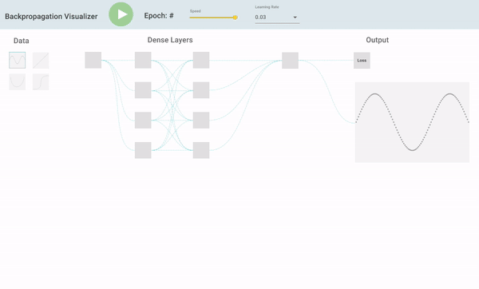

# Backpropagation Visualizer

## Progress

| Big Picture TODO        | Status        |
| ----------------------- | ------------- |
| Design                  | Done ✅       |
| Implementation          | In Progress 🖍 |
| Testing/Trying to break |               |

| Implementation TODO      | Status        |
| ------------------------ | ------------- |
| Create React App         | Done ✅       |
| Implement Neural Network | Done ✅       |
| Test Neural Network      |  Done ✅  |
| Create Scatter Plot      |  Done ✅              |
| Plot Best Fit            |   Done ✅             |
| Neural Network Graph     |   Done ✅             |
| On Click Graph           |  In Progress 🖍             |
| On Hover Graph           |   In Progress 🖍             |
| Polish and Test          |               |

## Getting Started

In the project directory, you can run:

`yarn install` to install node modules

`yarn start` to run on port 3000

## Design

Designs created in <a href="https://www.figma.com/file/y2qzrIE26gBjLvsBYxj72M/BackpropVisualizer">figma</a>. Go to <a href="https://docs.google.com/presentation/d/1wRmh6yn-17HEIQ0m4AQByZvGDS4vMtlV-SzJeSvFIpw/edit?usp=sharing">Slides</a> to see the development iterations.

</img>

This project was bootstrapped with [Create React App](https://github.com/facebook/create-react-app).
